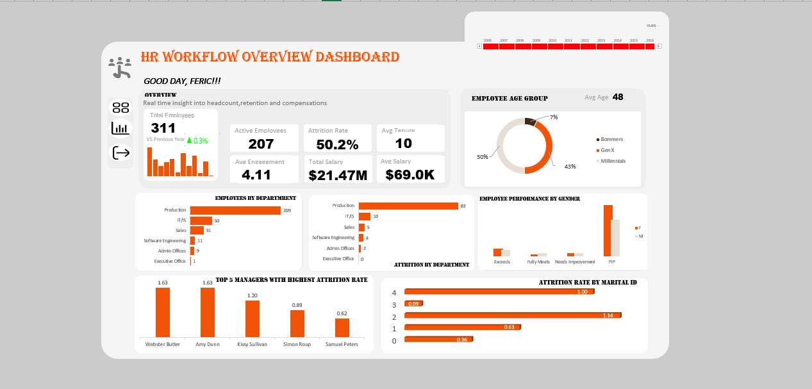

# HR Analytics Dashboard | Excel Project
An end-to-end HR Analytics project that transforms raw employee data into meaningful workforce insights using data cleaning, Power Query, Power Pivot/DAX, and interactive visualizations

---

## Table of Contents
- [Project Overview](#project-overview)
- [Tools and Technologies](#tools-and-technologies)
- [Dataset Overview](#dataset-overview)
- [Data Modeling (Power Query + DAX)](#data-modeling-power-query--dax)
- [Excel Dashboard](#excel-dashboard)
- [Key Insights](#key-insights)
- [Recommendations](#recommendations)
- [Future Work](#future-work)
- [Repository Structure](#repository-structure)

---

## Project Overview

## Project Overview

This project analyzes **311 employee records** to uncover insights into workforce demographics, salary, employee performance, engagement, tenure, workforce growth, and employee attrition. Using **Microsoft Excel, Power Query, Power Pivot, and DAX**, raw HR data was transformed into a structured analytical model with calculated measures, PivotTables, and interactive visualizations. The final dashboard provides a clear overview of key HR metrics and helps identify workforce patterns and areas that may require management attention.


---

## Tools and Technologies


---

## Dataset Overview

**Columns:**
```
Employee_Name, EmpID, MarriedID, MaritalStatusID, GenderID, EmpStatusID,
PerfScoreID, FromDiversityJobFairID, Salary, Termd, PositionID, State, DOB,
Sex, MaritalDesc, CitizenDesc, HispanicLatino, RaceDesc, DateofHire,
DateofTermination, TermReason, Department ID, ManagerID, RecruitmentSource,
EngagementSurvey, EmpSatisfaction, SpecialProjectsCount,
LastPerformanceReview_Date, DaysLateLast30, Absences
```

**Lookup tables:** Performance Score, State, Managers, Empstatus, Position, department

**Sample Preview:**

| Employee_Name | EmpID | Department ID | Salary | Termd | PerfScoreID |
|---|---|---|---|---|---|
| ... | ... | ... | ... | 0/1 | ... |

---

## Data Modeling (Power Query + DAX)

Rather than formula-driven worksheet columns, this workbook loads data straight into Excel's Data Model:

- **8 Power Query queries** (`Data`, `Date`, `department`, `Empstatus`, `Managers`, `Performance Score`, `Position`, `State`) import and shape the source tables before loading them to the model.
- **12 DAX measures** in Power Pivot drive every KPI card and chart on the dashboard:

| Measure | Purpose |
|---|---|
| `Employees` | Current headcount |
| `PY employees` | Prior-year headcount (for YoY comparison) |
| `YOY Empgrowth` | Year-over-year headcount growth |
| `Active` | Count of active employees |
| `Terminated` | Count of terminated employees |
| `Attrition Rate` | Terminated ÷ total headcount |
| `Sum of isTerminated` | Underlying terminated flag total |
| `Avg Salary` | Average salary |
| `Total Salary` | Total salary spend |
| `Avg Tenure` | Average years of tenure |
| `Average of Age` | Average employee age |
| `Avg Engagement` | Average engagement survey score |

>📐 **To view the DAX formulas behind the measures:**  
Open [H ANALYTICS.xlsx](./Data/H%20ANALYTICS.xlsx) → **Power Pivot** tab → **Manage** → **Measures** in the calculation area.

- **13 PivotTables** feed **10 PivotCharts**, all connected to a Date-of-Hire timeline slicer.

---

## Excel Dashboard

The dashboard includes:
- KPI cards — Employees, Active, Attrition Rate, Avg Tenure, Avg Engagement, Total Salary, Avg Salary (with YoY trend arrow)
- Headcount by month (line/bar)
- Attrition by Department
- Top 5 Managers with Highest Attrition Rate
- Employee Performance by Gender
- Employees by Department
- Attrition Rate by Marital ID
- Employee by Age Group
- Date-of-Hire timeline slicer.

**Screenshot:**



---

## Key Insights

- Headcount stands at **311 employees**, up **0.3%** year-over-year, with **207 active** and **104 terminated**.
- Overall **attrition rate is 50.2%**, with average tenure of **10 years**.
- **Production** is both the largest department (209 employees) and the biggest driver of attrition (83 terminated) — far ahead of every other department.
- Average salary is **$69.0K** (**$21.47M** total salary spend); average engagement score is **4.11**.
- **Webster Butler** and **Amy Dunn** are the managers with the highest attrition rates (1.63 each), notably above the 1.13 company-wide average.
- Performance score correlates with attrition — employees furthest from "Fully Meets" show the largest attrition shares.

---

## Recommendations

- Prioritize retention initiatives in **Production**, since it accounts for the majority of both headcount and departures.
- Review management practices and workload for **Webster Butler** and **Amy Dunn's** teams given above-average attrition under their reports.
- Investigate the link between low performance scores and attrition to see whether it reflects a performance-management or an engagement issue.
- Track engagement score alongside attrition rate over time to catch early warning signs before termination
* **Strengthen employee retention:** Investigate the major drivers of attrition and develop targeted retention strategies for high-turnover employee groups and departments.
* **Improve employee engagement:** Use employee feedback, recognition, communication, and development opportunities to improve engagement and satisfaction.
* **Enhance performance management:** Provide targeted training, mentoring, and follow-up support for employees requiring performance improvement.
* **Optimize workforce planning:** Use employee growth, tenure, department, and attrition trends to support better staffing and recruitment decisions.
* **Monitor management and departmental trends:** Regularly review employee performance and turnover patterns across departments and managers to identify areas requiring attention.
* **Maintain continuous HR analytics:** Refresh the dataset and dashboard regularly to ensure management has current information for workforce decision-making.


---

## Future Work

* **Migrate the dashboard to Power BI:** Rebuild and publish the Excel dashboard in Power BI for improved interactivity, sharing, and automated reporting.
* **Develop predictive attrition analysis:** Build a predictive model to identify employees who may be at higher risk of leaving based on factors such as engagement, satisfaction, salary, tenure, performance, and department.
* **Expand employee performance analysis:** Investigate the relationship between employee performance, engagement, satisfaction, and attrition to identify factors associated with employee retention and productivity.
* **Automate data refresh:** Improve the Power Query workflow to support automated or more frequent updates as new employee records become available.
* **Add advanced HR KPIs:** Incorporate additional metrics such as retention rate, absenteeism rate, average time to hire, employee satisfaction trends, and recruitment-source effectiveness.
* **Expand time-based analysis:** Analyze workforce growth, hiring, and termination trends over longer periods to identify seasonal and long-term patterns.

---

## Repository Structure

```
HR-Analytics-Dashboard-Excel/
├── README.md
├── HR_Analytics.xlsx
├── H_ANALYTICS.xlsx
└── images/
    └── visuals_dashboard.png
```
